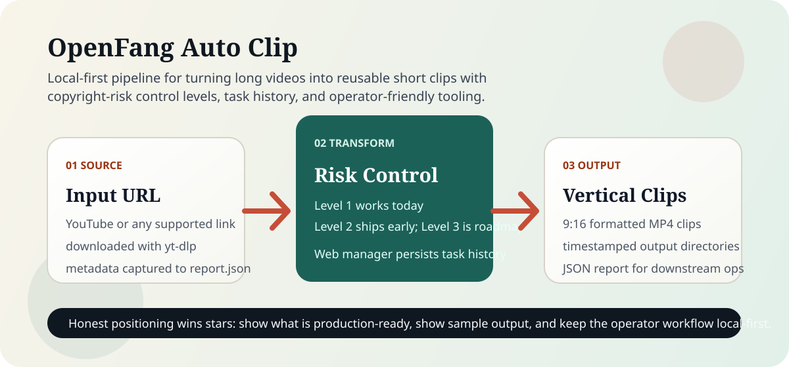

# OpenFang Auto Clip

<div align="center">

**本地优先的视频再利用流水线，强调可复现 benchmark、可信文档和可传播发布资产**

[](LICENSE)
[](https://www.python.org/downloads/)
[](https://github.com/outhsics/openfang-auto-clip/actions/workflows/ci.yml)

[English](README_EN.md) | 简体中文

</div>



## 60 秒判断值不值得看

- 先看项目状态快照：[PROJECT_STATUS.md](PROJECT_STATUS.md)
- 先跑不依赖外部素材的 benchmark：[examples/benchmark/README_ZH.md](examples/benchmark/README_ZH.md)
- 看一次真实输出结构示例：[examples/demo/README_ZH.md](examples/demo/README_ZH.md)
- 看可复用的 launch / demo 场景：[examples/showcases/README_ZH.md](examples/showcases/README_ZH.md)
- 看转换能力边界：[docs/TRANSFORMATION_ZH.md](docs/TRANSFORMATION_ZH.md)
- 看开源增长计划：[OPEN_SOURCE_PLAN.md](OPEN_SOURCE_PLAN.md)
- 以后让别的 AI 接手时先看：[AI_CONTEXT.md](AI_CONTEXT.md)

## 这个仓库今天已经能做什么

- 用 `yt-dlp` 下载源视频
- 跑一个可用的本地 Level 1 FFmpeg 视觉混音路径
- 在提供 transcript 的前提下生成一个带时间锚点、shot plan 和 review rubric 的 Level 2 脚本再生包
- 按简单本地策略切成 9:16 短视频片段
- 提供 `--doctor` 和 `--dry-run` 方便先验环境与流程
- 提供本地 Web 管理界面做任务启动和查看
- 提供 synthetic benchmark、release 素材和 social preview 生成脚本

## Reality Check / 现状说明

| Area | 状态 | 说明 |
|------|------|------|
| 下载 + 切片导出 | 可用 | 当前主 CLI 路径 |
| Level 1 视觉混音 | 可用 | FFmpeg 本地可复现 |
| Web 管理器 | 可用 | 本地操作台，不是 SaaS |
| Synthetic benchmark | 可用 | 无需外部素材 |
| Social preview / release 素材 | 可用 | 已有脚本 |
| Level 2 脚本重写 | 部分可用 | 已能生成 transcript-to-script 包、shot plan 和 blueprint，但还不能自动重建成片 |
| Level 3 完全重制 | 脚手架 | 还不是生产能力 |
| Hosted SaaS / 公共 API | 不提供 | 当前定位是 local-first |

## 快速开始

```bash
git clone https://github.com/outhsics/openfang-auto-clip.git
cd openfang-auto-clip

python3 -m venv .venv
source .venv/bin/activate
pip install -e .

./auto_clip.sh --doctor
python3 scripts/run_demo_benchmark.py
./auto_clip.sh "https://www.youtube.com/watch?v=VIDEO_ID" --dry-run
./auto_clip.sh "https://www.youtube.com/watch?v=VIDEO_ID" --transform 1 --duration 45
./auto_clip.sh "https://www.youtube.com/watch?v=VIDEO_ID" --transform 2 --transcript path/to/source.srt
```

如果你想用仓库自带安装脚本，见 [docs/INSTALLATION_ZH.md](docs/INSTALLATION_ZH.md)。

## 常用命令

```bash
# 检查本地环境
./auto_clip.sh --doctor

# 只生成执行计划，不下载媒体
./auto_clip.sh "URL" --dry-run

# 运行 synthetic benchmark
python3 scripts/run_demo_benchmark.py

# 基于 transcript 生成 Level 2 脚本包
./auto_clip.sh "URL" --transform 2 --transcript path/to/source.srt

# 生成 GitHub social preview 图
python3 scripts/generate_social_preview.py --report examples/benchmark/sample_benchmark_report.json --lang zh

# 生成带 benchmark 证据的 release bundle
python3 scripts/release_prep.py v0.3.0 --report tmp/demo-benchmark-v030/benchmark_report.json

# 启动本地 Web 管理器
./start_web_manager.sh

# 运行测试
python3 -m unittest discover -s tests
```

## 文档入口

- [DOCUMENTATION_ZH.md](DOCUMENTATION_ZH.md)
- [docs/INSTALLATION_ZH.md](docs/INSTALLATION_ZH.md)
- [docs/TRANSFORMATION_ZH.md](docs/TRANSFORMATION_ZH.md)
- [docs/SOCIAL_PREVIEW_ZH.md](docs/SOCIAL_PREVIEW_ZH.md)
- [docs/VERSIONING_ZH.md](docs/VERSIONING_ZH.md)
- [PROJECT_STATUS.md](PROJECT_STATUS.md)
- [OPEN_SOURCE_PLAN.md](OPEN_SOURCE_PLAN.md)
- [AI_CONTEXT.md](AI_CONTEXT.md)

## 对外定位

更准确的说法是：

- 一个本地优先的 operator workflow
- 一个可复现 benchmark 和 clip generation 仓库
- 一个今天已经能跑通 Level 1 的工具
- 一个已经交付 Level 2 第一阶段脚本包、但还没完成成片重建的项目

不应该继续这样说：

- 保证版权安全
- 已经是完整 SaaS
- Level 2 / 3 已经商业级可交付

## 支持与社区

- Bug： [GitHub Issues](https://github.com/outhsics/openfang-auto-clip/issues)
- 使用问题：看 [SUPPORT.md](SUPPORT.md)
- 安全问题：看 [SECURITY.md](SECURITY.md)
- 贡献方式：看 [CONTRIBUTING.md](CONTRIBUTING.md)

## License

仓库使用 MIT 许可证。涉及商业化或高风险使用前，请同时阅读 [LICENSE](LICENSE) 和 [DISCLAIMER.md](DISCLAIMER.md)。
